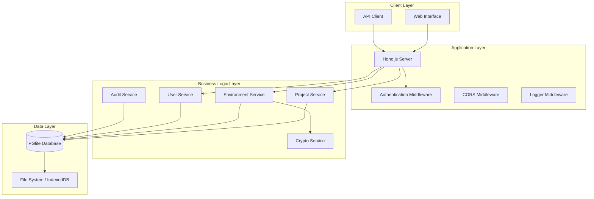
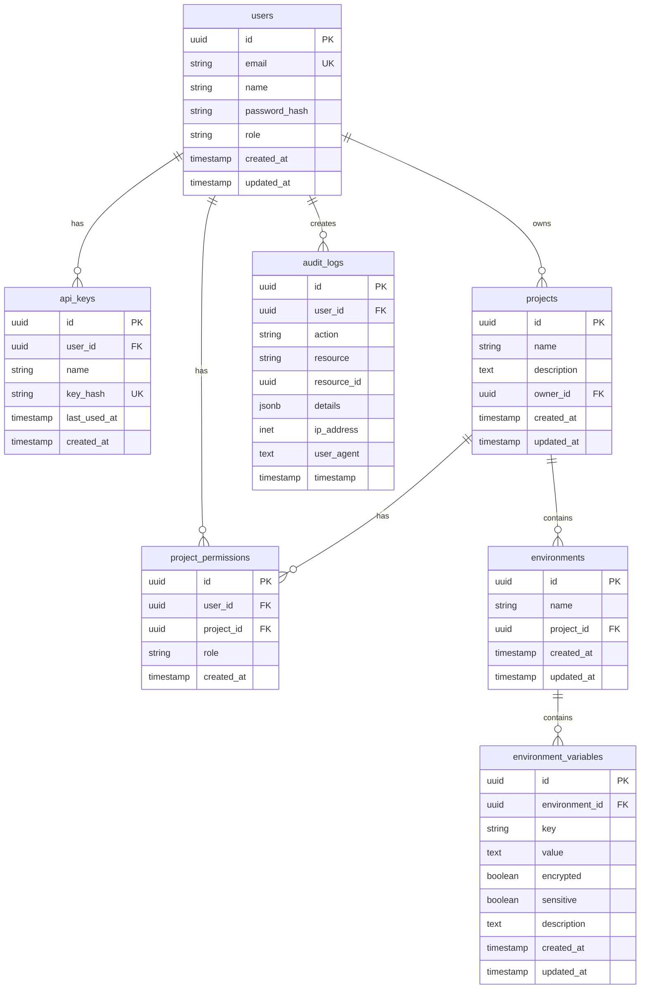

# Design Document

## Overview

envkey-lite是一个基于现代技术栈的轻量级环境变量管理系统，使用HonoJS作为Web框架和PGlite作为嵌入式数据库。该系统提供了envkey的核心功能，包括项目管理、环境变量的安全存储、API访问和Web界面管理，同时保持轻量级和易于部署的特性。

系统采用单体架构设计，所有组件运行在同一个进程中，简化了部署和维护。通过PGlite的嵌入式特性，系统可以在无需外部数据库的情况下运行，支持文件系统持久化或内存模式。

## Architecture

### 技术栈
- **Web框架**: HonoJS - 轻量级、高性能的Web框架
- **数据库**: PGlite - 嵌入式PostgreSQL，支持WASM运行
- **运行时**: Node.js/Bun/Deno (服务端) 或 Browser (客户端)
- **加密**: 内置crypto模块进行敏感数据加密
- **认证**: JWT + API Key双重认证机制

### 系统架构图



### 部署架构

系统支持多种部署模式：

1. **服务器部署**: 使用Node.js/Bun运行，数据持久化到文件系统
2. **容器部署**: Docker容器化部署，支持数据卷挂载
3. **边缘部署**: 支持Cloudflare Workers等边缘计算平台
4. **本地开发**: 支持内存模式快速启动

## Components and Interfaces

### 1. Web服务器组件 (HonoApp)

**职责**: 处理HTTP请求，路由分发，中间件管理

**接口**:
```typescript
interface HonoApp {
  // 路由定义
  get(path: string, ...handlers: Handler[]): Hono
  post(path: string, ...handlers: Handler[]): Hono
  put(path: string, ...handlers: Handler[]): Hono
  delete(path: string, ...handlers: Handler[]): Hono
  
  // 中间件
  use(middleware: MiddlewareHandler): Hono
  
  // 启动服务
  serve(options: ServeOptions): void
}

interface ServeOptions {
  port: number
  hostname?: string
}
```

**中间件栈**:
- CORS中间件: 处理跨域请求
- 认证中间件: JWT验证和API Key验证
- 日志中间件: 请求日志记录
- 错误处理中间件: 统一错误响应格式

### 2. 数据库组件 (DatabaseManager)

**职责**: 管理PGlite数据库连接，执行SQL操作

**接口**:
```typescript
interface DatabaseManager {
  // 初始化数据库
  initialize(config: DatabaseConfig): Promise<void>
  
  // 查询操作
  query<T>(sql: string, params?: any[]): Promise<QueryResult<T>>
  
  // 事务操作
  transaction<T>(callback: (tx: Transaction) => Promise<T>): Promise<T>
  
  // 关闭连接
  close(): Promise<void>
}

interface DatabaseConfig {
  dataDir?: string  // 数据目录，undefined为内存模式
  extensions?: Record<string, any>
}
```

### 3. 项目管理组件 (ProjectService)

**职责**: 管理项目的CRUD操作，环境配置

**接口**:
```typescript
interface ProjectService {
  // 项目操作
  createProject(data: CreateProjectData): Promise<Project>
  getProject(id: string): Promise<Project | null>
  listProjects(userId: string): Promise<Project[]>
  updateProject(id: string, data: UpdateProjectData): Promise<Project>
  deleteProject(id: string): Promise<void>
  
  // 环境操作
  createEnvironment(projectId: string, data: CreateEnvironmentData): Promise<Environment>
  listEnvironments(projectId: string): Promise<Environment[]>
  deleteEnvironment(id: string): Promise<void>
}

interface Project {
  id: string
  name: string
  description?: string
  ownerId: string
  createdAt: Date
  updatedAt: Date
}

interface Environment {
  id: string
  name: string
  projectId: string
  createdAt: Date
  updatedAt: Date
}
```

### 4. 环境变量管理组件 (EnvironmentVariableService)

**职责**: 管理环境变量的CRUD操作，加密存储

**接口**:
```typescript
interface EnvironmentVariableService {
  // 变量操作
  setVariable(envId: string, key: string, value: string, options?: SetVariableOptions): Promise<EnvironmentVariable>
  getVariable(envId: string, key: string): Promise<EnvironmentVariable | null>
  listVariables(envId: string): Promise<EnvironmentVariable[]>
  deleteVariable(envId: string, key: string): Promise<void>
  
  // 批量操作
  setVariables(envId: string, variables: Record<string, string>): Promise<void>
  exportVariables(envId: string, format: ExportFormat): Promise<string>
  importVariables(envId: string, data: string, format: ImportFormat): Promise<ImportResult>
}

interface EnvironmentVariable {
  id: string
  environmentId: string
  key: string
  value: string  // 解密后的值
  encrypted: boolean
  sensitive: boolean
  createdAt: Date
  updatedAt: Date
}

interface SetVariableOptions {
  sensitive?: boolean
  description?: string
}
```

### 5. 加密服务组件 (CryptoService)

**职责**: 处理敏感数据的加密和解密

**接口**:
```typescript
interface CryptoService {
  // 加密解密
  encrypt(plaintext: string): Promise<string>
  decrypt(ciphertext: string): Promise<string>
  
  // 密钥管理
  generateKey(): Promise<string>
  rotateKey(oldKey: string, newKey: string): Promise<void>
  
  // 哈希
  hash(data: string): Promise<string>
  verify(data: string, hash: string): Promise<boolean>
}
```

### 6. 用户管理组件 (UserService)

**职责**: 用户认证，权限管理

**接口**:
```typescript
interface UserService {
  // 用户操作
  createUser(data: CreateUserData): Promise<User>
  getUser(id: string): Promise<User | null>
  getUserByEmail(email: string): Promise<User | null>
  updateUser(id: string, data: UpdateUserData): Promise<User>
  deleteUser(id: string): Promise<void>
  
  // 认证
  authenticate(email: string, password: string): Promise<AuthResult>
  generateApiKey(userId: string, name: string): Promise<ApiKey>
  validateApiKey(key: string): Promise<User | null>
  
  // 权限
  checkPermission(userId: string, resource: string, action: string): Promise<boolean>
  grantPermission(userId: string, projectId: string, role: Role): Promise<void>
}

interface User {
  id: string
  email: string
  name: string
  role: 'admin' | 'user'
  createdAt: Date
  updatedAt: Date
}

interface ApiKey {
  id: string
  userId: string
  name: string
  key: string
  lastUsedAt?: Date
  createdAt: Date
}
```

### 7. 审计日志组件 (AuditService)

**职责**: 记录系统操作日志，安全审计

**接口**:
```typescript
interface AuditService {
  // 日志记录
  log(event: AuditEvent): Promise<void>
  
  // 日志查询
  getLogs(filters: AuditFilters): Promise<AuditLog[]>
  
  // 日志清理
  cleanup(retentionDays: number): Promise<number>
}

interface AuditEvent {
  userId?: string
  action: string
  resource: string
  resourceId?: string
  details?: Record<string, any>
  ipAddress?: string
  userAgent?: string
}

interface AuditLog extends AuditEvent {
  id: string
  timestamp: Date
}
```

## Data Models

### 数据库Schema设计

```sql
-- 用户表
CREATE TABLE users (
    id UUID PRIMARY KEY DEFAULT gen_random_uuid(),
    email VARCHAR(255) UNIQUE NOT NULL,
    name VARCHAR(255) NOT NULL,
    password_hash VARCHAR(255) NOT NULL,
    role VARCHAR(50) DEFAULT 'user',
    created_at TIMESTAMP DEFAULT CURRENT_TIMESTAMP,
    updated_at TIMESTAMP DEFAULT CURRENT_TIMESTAMP
);

-- API密钥表
CREATE TABLE api_keys (
    id UUID PRIMARY KEY DEFAULT gen_random_uuid(),
    user_id UUID REFERENCES users(id) ON DELETE CASCADE,
    name VARCHAR(255) NOT NULL,
    key_hash VARCHAR(255) UNIQUE NOT NULL,
    last_used_at TIMESTAMP,
    created_at TIMESTAMP DEFAULT CURRENT_TIMESTAMP
);

-- 项目表
CREATE TABLE projects (
    id UUID PRIMARY KEY DEFAULT gen_random_uuid(),
    name VARCHAR(255) NOT NULL,
    description TEXT,
    owner_id UUID REFERENCES users(id) ON DELETE CASCADE,
    created_at TIMESTAMP DEFAULT CURRENT_TIMESTAMP,
    updated_at TIMESTAMP DEFAULT CURRENT_TIMESTAMP
);

-- 环境表
CREATE TABLE environments (
    id UUID PRIMARY KEY DEFAULT gen_random_uuid(),
    name VARCHAR(255) NOT NULL,
    project_id UUID REFERENCES projects(id) ON DELETE CASCADE,
    created_at TIMESTAMP DEFAULT CURRENT_TIMESTAMP,
    updated_at TIMESTAMP DEFAULT CURRENT_TIMESTAMP,
    UNIQUE(project_id, name)
);

-- 环境变量表
CREATE TABLE environment_variables (
    id UUID PRIMARY KEY DEFAULT gen_random_uuid(),
    environment_id UUID REFERENCES environments(id) ON DELETE CASCADE,
    key VARCHAR(255) NOT NULL,
    value TEXT NOT NULL,
    encrypted BOOLEAN DEFAULT FALSE,
    sensitive BOOLEAN DEFAULT FALSE,
    description TEXT,
    created_at TIMESTAMP DEFAULT CURRENT_TIMESTAMP,
    updated_at TIMESTAMP DEFAULT CURRENT_TIMESTAMP,
    UNIQUE(environment_id, key)
);

-- 项目权限表
CREATE TABLE project_permissions (
    id UUID PRIMARY KEY DEFAULT gen_random_uuid(),
    user_id UUID REFERENCES users(id) ON DELETE CASCADE,
    project_id UUID REFERENCES projects(id) ON DELETE CASCADE,
    role VARCHAR(50) NOT NULL, -- 'owner', 'admin', 'editor', 'viewer'
    created_at TIMESTAMP DEFAULT CURRENT_TIMESTAMP,
    UNIQUE(user_id, project_id)
);

-- 审计日志表
CREATE TABLE audit_logs (
    id UUID PRIMARY KEY DEFAULT gen_random_uuid(),
    user_id UUID REFERENCES users(id) ON DELETE SET NULL,
    action VARCHAR(255) NOT NULL,
    resource VARCHAR(255) NOT NULL,
    resource_id UUID,
    details JSONB,
    ip_address INET,
    user_agent TEXT,
    timestamp TIMESTAMP DEFAULT CURRENT_TIMESTAMP
);

-- 系统配置表
CREATE TABLE system_config (
    key VARCHAR(255) PRIMARY KEY,
    value JSONB NOT NULL,
    updated_at TIMESTAMP DEFAULT CURRENT_TIMESTAMP
);

-- 创建索引
CREATE INDEX idx_api_keys_user_id ON api_keys(user_id);
CREATE INDEX idx_projects_owner_id ON projects(owner_id);
CREATE INDEX idx_environments_project_id ON environments(project_id);
CREATE INDEX idx_environment_variables_environment_id ON environment_variables(environment_id);
CREATE INDEX idx_project_permissions_user_id ON project_permissions(user_id);
CREATE INDEX idx_project_permissions_project_id ON project_permissions(project_id);
CREATE INDEX idx_audit_logs_user_id ON audit_logs(user_id);
CREATE INDEX idx_audit_logs_timestamp ON audit_logs(timestamp);
CREATE INDEX idx_audit_logs_resource ON audit_logs(resource, resource_id);
```

### 数据关系图



## Error Handling

### 错误分类和处理策略

1. **业务逻辑错误**
   - 用户输入验证错误
   - 权限不足错误
   - 资源不存在错误
   - 业务规则违反错误

2. **系统错误**
   - 数据库连接错误
   - 文件系统错误
   - 网络错误
   - 内存不足错误

3. **安全错误**
   - 认证失败
   - 授权失败
   - 恶意请求检测
   - 速率限制触发

### 错误响应格式

```typescript
interface ErrorResponse {
  error: {
    code: string
    message: string
    details?: Record<string, any>
    timestamp: string
    requestId: string
  }
}

// 错误代码定义
enum ErrorCode {
  // 认证错误 (1000-1099)
  UNAUTHORIZED = 'AUTH_001',
  INVALID_TOKEN = 'AUTH_002',
  TOKEN_EXPIRED = 'AUTH_003',
  INVALID_API_KEY = 'AUTH_004',
  
  // 授权错误 (1100-1199)
  FORBIDDEN = 'AUTHZ_001',
  INSUFFICIENT_PERMISSIONS = 'AUTHZ_002',
  
  // 验证错误 (1200-1299)
  VALIDATION_ERROR = 'VALID_001',
  INVALID_INPUT = 'VALID_002',
  MISSING_REQUIRED_FIELD = 'VALID_003',
  
  // 资源错误 (1300-1399)
  RESOURCE_NOT_FOUND = 'RES_001',
  RESOURCE_ALREADY_EXISTS = 'RES_002',
  RESOURCE_CONFLICT = 'RES_003',
  
  // 系统错误 (1400-1499)
  INTERNAL_ERROR = 'SYS_001',
  DATABASE_ERROR = 'SYS_002',
  FILESYSTEM_ERROR = 'SYS_003',
  
  // 速率限制 (1500-1599)
  RATE_LIMIT_EXCEEDED = 'RATE_001'
}
```

### 错误处理中间件

```typescript
const errorHandler: MiddlewareHandler = async (c, next) => {
  try {
    await next()
  } catch (error) {
    const requestId = c.get('requestId') || generateRequestId()
    
    // 记录错误日志
    console.error(`[${requestId}] Error:`, error)
    
    // 根据错误类型返回相应的HTTP状态码和错误信息
    if (error instanceof ValidationError) {
      return c.json({
        error: {
          code: error.code,
          message: error.message,
          details: error.details,
          timestamp: new Date().toISOString(),
          requestId
        }
      }, 400)
    }
    
    if (error instanceof AuthenticationError) {
      return c.json({
        error: {
          code: error.code,
          message: error.message,
          timestamp: new Date().toISOString(),
          requestId
        }
      }, 401)
    }
    
    // 默认内部服务器错误
    return c.json({
      error: {
        code: ErrorCode.INTERNAL_ERROR,
        message: 'Internal server error',
        timestamp: new Date().toISOString(),
        requestId
      }
    }, 500)
  }
}
```

## Testing Strategy

### 测试层次结构

1. **单元测试**
   - 服务层逻辑测试
   - 工具函数测试
   - 数据模型验证测试
   - 加密解密功能测试

2. **集成测试**
   - API端点测试
   - 数据库操作测试
   - 中间件集成测试
   - 第三方服务集成测试

3. **端到端测试**
   - 完整用户流程测试
   - Web界面功能测试
   - API客户端集成测试

### 测试工具和框架

- **测试框架**: Vitest (快速、现代的测试框架)
- **HTTP测试**: Supertest (API端点测试)
- **数据库测试**: 内存模式PGlite (快速、隔离的数据库测试)
- **Mock工具**: Vitest内置mock功能
- **覆盖率**: c8 (代码覆盖率报告)

### 测试配置示例

```typescript
// vitest.config.ts
import { defineConfig } from 'vitest/config'

export default defineConfig({
  test: {
    environment: 'node',
    globals: true,
    coverage: {
      provider: 'c8',
      reporter: ['text', 'json', 'html'],
      exclude: [
        'node_modules/',
        'dist/',
        '**/*.test.ts',
        '**/*.spec.ts'
      ]
    },
    setupFiles: ['./test/setup.ts']
  }
})

// test/setup.ts
import { beforeAll, afterAll } from 'vitest'
import { PGlite } from '@electric-sql/pglite'

let testDb: PGlite

beforeAll(async () => {
  // 创建内存数据库用于测试
  testDb = new PGlite()
  
  // 运行数据库迁移
  await testDb.exec(/* SQL schema */)
})

afterAll(async () => {
  await testDb.close()
})

export { testDb }
```

### 测试数据管理

- 使用工厂模式创建测试数据
- 每个测试用例使用独立的数据集
- 测试结束后清理数据
- 使用种子数据进行一致性测试

### 性能测试

- API响应时间测试
- 数据库查询性能测试
- 内存使用监控
- 并发请求处理能力测试

通过这个全面的设计文档，我们为envkey-lite项目建立了清晰的技术架构和实现方案，确保系统的可扩展性、安全性和可维护性。